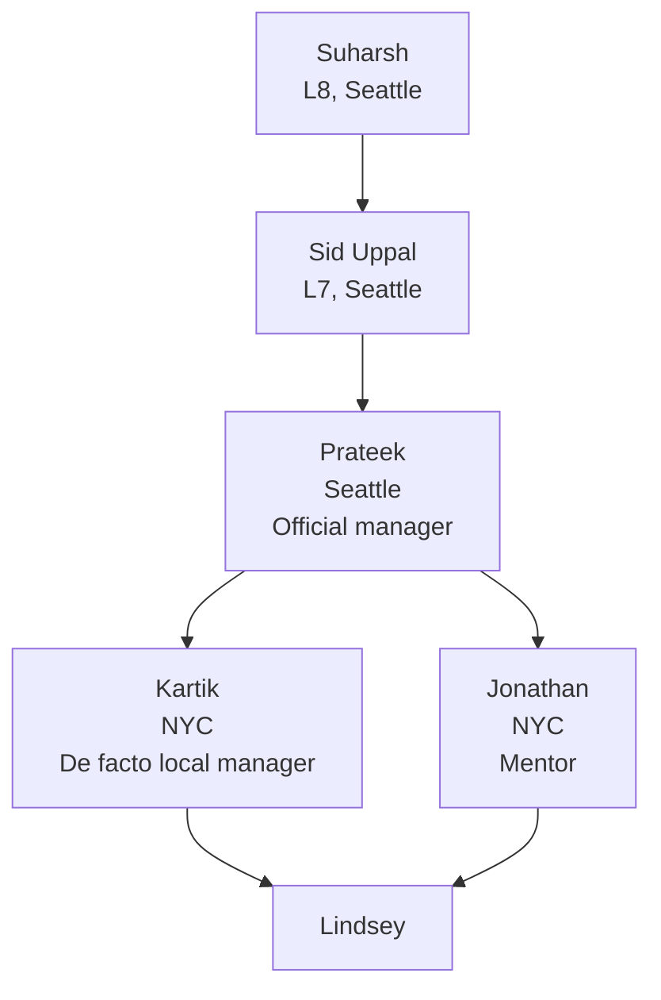

# About This Project — Lindsey's AWS Quick Suite 2026 Summer Internship

This skill is the canonical background document for everything that happens in this repo. Whenever team, product, goals, cadence, or people relationships come up in conversation, this document is the source of truth.

---

## 1. Who I Am (About Lindsey)

- **Name:** Yingzi (Lindsey) Zhang
- **School:** Northeastern University
- **Program:** Master of Science in Computer Science
- **Year:** 2nd-year graduate student, expected graduation June 2027

### Technical Background

**Programming languages:**
- **Python:** strongest language; comfortable with syntax and writing code
- **Java / C / C++:** can read code, cannot write independently
- **TypeScript / Node.js:** no exposure yet, but the intern team may use these

**Conceptual knowledge:**
- Broad awareness of the full-stack landscape (frontend frameworks, backend architecture, databases, CI/CD, etc.)
- Knows how the pieces relate
- **But:** mostly conceptual — limited hands-on experience

**AWS experience:**
- Knows EC2, S3, Lambda by name
- Followed tutorials in the AWS Console for coursework, but without understanding what was happening
- No independent experience operating AWS services

**BI / data / AI infra experience:**
- Has never used a BI tool
- Unfamiliar with AI workflow automation and data orchestration

**Project experience:**
- Built simple OOD (object-oriented design) projects for school with AI assistance
- No full internship or enterprise-grade project experience
- Currently working with external mentor (Mac) on open-source engineering practices via the `lindsey_learn_open_source_101` project — the four scaffolding tracks (CI, CodeCov, ReadTheDocs, PyPI) are wired up, but the line-by-line know-how isn't fully internalized yet

---

## 2. Internship Basics

| Item | Value |
|------|-------|
| **Company** | Amazon Web Services (AWS) |
| **Title** | Software Dev Engineer Intern — Computer Science |
| **Dates** | 2026-06-01 → 2026-08-21 (~12 weeks) |
| **Team** | Quick Suite (Amazon Quick product line) |
| **Location** | New York City office |

---

## 3. About Amazon Quick Suite (The Product)

### ⚠️ Important clarification: Quick Suite ≠ QuickSight

Quick Suite (officially "Amazon Quick") is a **comprehensive generative-AI-powered analytics + AI platform**. The original Amazon QuickSight has been rebranded to Amazon Quick and expanded from a pure BI service into a comprehensive platform. The original QuickSight functionality (dashboards, SPICE, embedded analytics) is preserved as the Quick Sight sub-component, with all existing APIs, SDKs, and integrations unchanged.

### The five Quick Suite sub-products

1. **Amazon Quick Sight** — data visualization and BI. The former QuickSight. Connects data sources, builds interactive dashboards, runs the SPICE in-memory engine, supports embedded analytics, and provides ML insights (forecasting, anomaly detection).
2. **Amazon Quick Flows** — intelligent workflow automation. Combines AI processing with structured automation steps for complex business processes; uses action connectors to integrate external systems. This is what the mentor refers to when he mentions "running a Quick Flow."
3. **Amazon Quick Automate** — process optimization. Automates common business processes and repetitive tasks. Complementary to Quick Flows, with more emphasis on simplification and standardization.
4. **Amazon Quick Index** — data discovery and cataloging. Helps users find the right information across enterprise data.
5. **Amazon Quick Research** — comprehensive analysis. AI-powered deep research that can analyze hundreds of documents, reports, or datasets at once, exploring complex data relationships through natural-language queries.

### Additional Quick Suite capabilities

- **Custom Agents** — configurable AI agents with domain expertise that automate analysis tasks via conversational interfaces
- **Apps in Amazon Quick** — describe an app in natural language and have a working web application generated, with built-in storage and Quick Sight visual embedding
- **Extensions** — integrations into browsers, Slack, Microsoft Office, and other existing tools
- **Spaces & Folders** — collaborative workspaces that aggregate data, dashboards, and knowledge

### Product positioning

Quick Suite is essentially **traditional BI + AI/GenAI + workflow automation + app construction, unified into one platform**. It is not just a tool to view data — it is the underlying infrastructure that lets enterprises analyze, automate, and collaborate with AI. This is what the mentor means by "the foundation layer of Amazon's AI traffic."

### Key technical traits

- **SPICE** — in-memory compute engine for high-performance analytics
- **Serverless architecture** — fully managed, no infrastructure to deploy
- **25+ third-party integrations** — connections to external applications
- **Enterprise-grade security** — granular permissions, row-level security, column-level security
- **Scales to hundreds of thousands of users**

### About the "Click" / "Quik" transcripts

The 2026-06-01 1:1 transcripts repeatedly render the product as "Click" / "Quik" / "Quick" with inconsistent spelling. These are almost certainly Teams auto-caption renderings of **Quick** — i.e., Amazon Quick / Quick Suite — and not a separate product. Whenever such spellings appear later, read them as Quick.

---

## 4. Current Team Structure and People

Lindsey's reporting line and the people she works with day to day.

### Reporting chain

Lindsey has two effective points of contact in NYC. Kartik is the de facto local manager and owns admin and project coordination. Jonathan is the mentor, runs a daily 15 minute standup, and is the first stop for technical questions and product onboarding. Prateek is the official manager on the HR and performance line, based in Seattle, with minimal day to day contact. Sid Uppal (L7) and Suharsh (L8) sit above Prateek in the Seattle leadership chain.

### People reference

| Person | Role | Location | Relationship to Lindsey |
|--------|------|----------|------------------------|
| Jonathan | Mentor and technical guide | NYC | Daily 15 minute standup. First point of contact for technical questions, product onboarding, and day to day unblocking. |
| Kartik | De facto local manager | NYC | Handles admin and project coordination on the NY side. |
| Prateek | Official manager | Seattle | HR and performance line. Minimal direct contact so far. |
| Sid Uppal | L7 senior leader | Seattle | Two levels above Prateek in the reporting chain. |
| Suharsh | L8 senior leader | Seattle | Three levels above Prateek in the reporting chain. |
| Sairam | Team peer | NYC | Will help with Lindsey's project as needed. Exact role to be confirmed. |
| Mac | External mentor (non Amazon) | Remote | Pre internship and ongoing coaching. Builds scaffolds and walks Lindsey through the know how. See Section 7. |

### Default routing for who to go to

Technical questions, product questions, and onboarding logistics go to Jonathan first. The daily standup is the most reliable channel, and Slack works as always on async backup. Project direction, scope, and anything that needs local coordination goes to Kartik. HR, admin, and performance topics go to Prateek, with the understanding that response time will be slower since he is remote. Lateral support and specific skills are best unlocked by proactively scheduling 1:1s with peers like Sairam.

---

## 5. Internship Timeline

The core deliverable is a **Design Doc**. The flow has three phases:

| Phase | Window | Content |
|-------|--------|---------|
| **Phase 1: Design Doc** | Weeks 1–3 (6.1 – 6.19) | Work with Manager and Mentor to converge on a Design Doc that defines what to build over 3 months |
| **Phase 2: Execution** | Weeks 4–8 (6.22 – 7.24) | Execute against the Design Doc |
| **Phase 3: Presentation** | Weeks 9–12 (7.27 – 8.21) | Prepare and deliver the final presentation showing the 3-month outcome |

### Reference: the Wilbur Design Doc (previous intern on the same team)

Lindsey has a copy of a previous intern's Design Doc (the Wilbur project). It covers:
- Problem Statement → Scope → Architecture → Implementation → API Design → Database → Deployment → Testing → Milestones
- Stack: Lambda + API Gateway + DynamoDB + Bedrock (for AI recommendations)
- Project: a backend management service for a video template system (Elmer) — CRUD, template validation, template parsing, and AI-driven template recommendation
- Deployment: Beta → Gamma → Prod across three regions (us-east-1, eu-west-1, us-west-2) with 12-hour bake time
- Use this as the architecture and completeness benchmark for Lindsey's own Design Doc

### About the specific summer project

On 2026-06-01 Jonathan explicitly said: "We'll get to the project later in the week once we sort things out on our end — probably not for another two days." So the first 2–3 days are focused on **embark onboarding tasks + deep hands-on with the product (desktop app)**, not on pushing the project forward yet.

---

## 6. Goals

### Top goal: land a Return Offer (Incline)

This is the #1 priority. Every learning activity and preparation effort serves this goal.

### Secondary goal: technical growth

- Move from "conceptual familiarity" to "can deliver independently"
- By the end of the internship, aim to be at the level of a "full-time L4 AWS engineer who can carry their own weight"

### What "earning an Incline" actually means

Per Mac's guidance, landing an Incline is not just "completing the tasks." It requires:

1. **Delivery quality far above expectations.** Mac's exact phrasing: "the ask is 100 points, deliver 250+."
2. **Sustained visibility.** Not a one-shot at the end — visibility built continuously through blog posts, tech talks, KT (knowledge transfer) sessions, and developer experience contributions.
3. **Demonstrating Leadership Principles.** This is the core evaluation lens in Amazon culture.

---

## 7. Known Gaps

| Gap | What it looks like | Impact |
|-----|-------------------|--------|
| **English communication** | Spoken English not fully fluent; technical discussion may be hard to follow | Affects Design Doc review, daily standup, and final Presentation |
| **Limited technical depth** | Knows many concepts, hasn't built much | Affects development velocity in the Execution phase |
| **Limited AWS experience** | No hands-on AWS service experience | Affects ability to understand the team's architecture and code |
| **Quick Suite knowledge gap** | Unfamiliar with the five Quick Suite sub-products and their architecture | Affects product understanding and Design Doc quality |
| **No enterprise project experience** | Unfamiliar with how enterprises run development and collaboration | Affects Day-1 ramp-up speed |

### Amazon-specific things to absorb quickly

- **embark** = Amazon's onboarding system. Task-heavy in week 1, tapers off afterward.
- **Build system** = Bazel (analogous to Maven / Gradle)
- **Terminology**: a pull request at Amazon is called a **CR** ("code review")
- **Primary languages on the team**: Scala and Python
- **LLM-assisted coding is the default.** Jonathan explicitly said: "we heavily use LLMs for coding, and you should leverage that too." This is the expected work style, not optional.

---

## 8. External Mentor and Support System

### Mac (external mentor, not at Amazon)

- **Role:** AWS architect and data analyst. Coaches Lindsey before and during the internship.
- **What he provides:** scaffolds entire projects in advance, bringing the "completeness" baseline to 500 points. Lindsey's job is to understand and explain the scaffold cold.
- **Coaching model:** Mac builds the project → Lindsey walks through it in 15–20 small steps → Lindsey internalizes the know-how → Lindsey can explain it to others.

### The most important things Mac has said

1. **How to use AI well.** Don't ask "how" or "what" first — ask **why**. Use framework-style questions like: "If we didn't do it this way, what would go wrong in an enterprise collaboration setting?" This reverse-style question is much more effective than asking "why are we doing it this way."
2. **Engineering mindset vs. toy mindset.** Production-grade projects and toy projects differ enormously in completeness. Use scaffolds to encapsulate the "completeness" dimension so you can focus on business logic. This is the core difference between engineering and "playing house with toys."
3. **Aim for the overwhelming level.** Not just "good enough" — be on a different plane from your peers. Arrive on Day 1 with a GitHub demo, blog posts, and even a v0 Design Doc so the team is impressed from the start.

---

## 9. Available Resources

| Resource | Status | Use |
|----------|--------|-----|
| Wilbur Design Doc | ✅ Have it | Format and content benchmark for Lindsey's own Design Doc |
| Mentor (Mac) chat history | ✅ Have it | Understand Mac's advice and thinking style |
| `lindsey_learn_open_source_101` project | ✅ Scaffolded (CI / CodeCov / RTD / PyPI all wired) | Foundation for learning engineering practices; need to internalize line-by-line know-how |
| AWS Quick Suite official docs | ✅ Links confirmed | Authoritative information source |
| Quick Suite environment | ❌ Not yet set up | Need a live environment to actually experience the product |
| GitHub POC repo | ❌ Not yet created | Mac plans to scaffold `quick_suite_orchestration_poc-project` |

### Confirmed official documentation links

- Quick Suite (Amazon Quick) user guide: https://docs.aws.amazon.com/quick/latest/userguide/what-is.html
- Quick Suite how it works: https://docs.aws.amazon.com/quicksuite/latest/userguide/how-quicksuite-works.html
- Quick Sight developer guide: https://docs.aws.amazon.com/quicksight/latest/developerguide/welcome.html

---

## 10. How to Use This Document

**For Claude (consuming this skill):**

- When Lindsey asks about the project, team, product, people, goals, or cadence, **anchor on this document first**, then engage with the specific question
- When a name surfaces in conversation (Jonathan / Kartik / Prateek / Sid / Suharsh / Sairam / Pankhuri / Siddharth / etc.), check Section 4 for role and relationship before responding
- Anything tagged **⭐ Low confidence** or **"to be confirmed by Lindsey"** is **not** a fact — surface the uncertainty so Lindsey can verify rather than acting on it as ground truth
- Remember the org is currently in a management-transition window when offering advice — factor that in
- For "who should I go to" questions, use the default routing list at the end of Section 4

**For Lindsey:**

- Every time a piece of information is confirmed or corrected (e.g. you learn who Pankhuri / Siddharth actually are, or Prateek finally has a 1:1 with you), come back and update the relevant section
- This is your single source of truth — when reality diverges from the document, edit the document
- Treat this as your persistent memory across Claude sessions; it is far more efficient than re-explaining context every time
