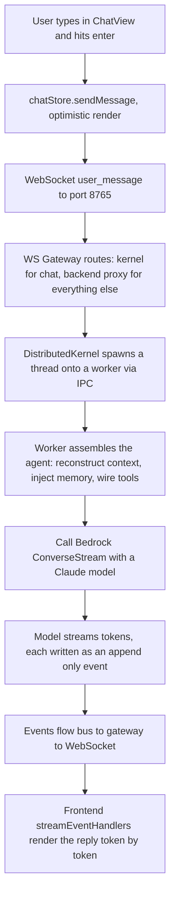

# QuickWork Codebase Overview

A compressed overview of the AWS Quick Work codebase, written after reading through the source. The goal is to capture the twenty percent that explains eighty percent of how the system works, as a shared reference for discussion.

---

## 1. What QuickWork Is

QuickWork is a desktop AI personal assistant that runs on the user's laptop. The frontend is Electron with React and TypeScript (`app/`). The backend is Python 3.12 (`src/aws_quick_work/`) built on the AWS Strands Agents SDK and Bedrock with Claude models. The frontend and backend talk over WebSocket on port 8765 for real time chat and streaming, and over HTTP on port 8766 for static assets and REST.

The design philosophy is the thing to internalize. The team builds the AI agent runtime as if it were an operating system. There is a kernel, a scheduler, processes (the agents), inter process communication through an event bus, per session file systems, a permission model, and background daemons (scheduled agents). Once you see it as an operating system, every module has an obvious place.

---

## 2. The Layered Backend (L0 to L3)

The Python backend follows a strict dependency direction. Upper layers may depend on lower layers, and lower layers never depend on upper ones. Writing code in the wrong layer creates a circular dependency and breaks the build, so the layer of a feature is decided by asking what it depends on.

| Layer | Package | Responsibility |
|---|---|---|
| L3 | `qw_hypervisor` | Orchestration: kernel, worker, gateway, scheduler |
| L2 | `qw_agent` | Assembles tools, memory, prompt, and model into a runnable agent |
| L1 | `qw_tools`, `qw_memory`, `qw_knowledge` | Tool functions, self evolving memory, RAG and knowledge graph |
| L0 | `qw_core` | Config, auth, session and event log, permissions, streaming, sandbox |

---

## 3. The Runtime Processes

Running the dev server starts a small set of processes that mirror the operating system framing.

| Process | Role |
|---|---|
| hypervisor | Central orchestrator. Hosts the gateway, the kernel, and various services |
| backend (`qw_agent`) | Handles non chat WebSocket messages such as settings, sessions, voice, and MCP |
| worker-N | Child process that actually runs agent threads and executes tools |
| docraster | Renders PDFs and screenshots |
| ui | Vite dev server for the frontend |

The communication rule is consistent. The frontend talks to the hypervisor over WebSocket and HTTP. The kernel talks to workers over Unix socket IPC. Inside the kernel path every message between components flows through a bus rather than a direct function call.

---

## 4. How One Message Flows End to End

This single path is the most valuable thing to understand, because almost every feature is a variation on it.

A subtle but important detail is that the frontend does not send conversation history. The backend owns history. The frontend only sends the new message, and the backend reconstructs context from its event log before each model call.

---

## 5. The Three Pillars That Make It More Than a Chatbot

These three capabilities are what separate QuickWork from an ordinary chat interface.

The first is memory (`qw_memory`). The system learns from each conversation in the background and stores two kinds of memory. Procedures are reusable code patterns, and facts are statements about the user. Each memory carries a confidence score composed of two independent dimensions, trust (how authoritative the source is) and utility (a Bayesian success and failure score weighted toward recent outcomes). Good memories strengthen and misleading ones decay, which is natural selection for memory.

The second is knowledge (`qw_knowledge`). Local files are indexed into SQLite for retrieval augmented generation using hybrid search, which combines BM25 keyword matching with vector similarity. Separately, a knowledge graph extracts entities and relationships from documents and integrations. RAG runs in process and is fast, while knowledge graph extraction runs on a worker because LLM extraction is slow and expensive.

The third is proactive intelligence. Scheduled agents run in the background on a timer, monitor integrations, organize notifications, and push updates to an activity feed. This is the part of the product that acts without the user asking.

---

## 6. Event Sourcing Is the Foundation

All session state is derived from an append only event log. Everything visible on screen, the user message, each token of the reply, every tool call, and the thinking steps, is stored not as a finished conversation but as a sequence of events appended in order. This design means the full state can be rebuilt by replaying the log, and a new branch can be forked from any point. It is the technical reason the backend can own history while the frontend stays thin.

---

## 7. Where My Project Likely Fits

The likely email into Workstreams direction maps cleanly onto an existing pattern in this codebase. The knowledge layer already has an integration ingestion path where calling a Slack, Email, Gmail, Teams, or calendar tool fires an event that gets dispatched to a worker for processing. An email connector would pull email data through that kind of path, the per item processing (summarize, flag actionable, embed) matches how the system already handles incoming content, and a scheduled agent would surface the result proactively in the activity feed. In other words, the project is not a new island. It plugs into the connector, event, and scheduled agent machinery the system is already built around.
